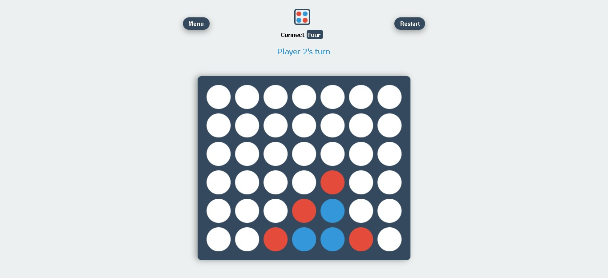

# Connect Four Game

This is my 45 Project in the 50 project Challange to practice vanilla JavaScript, a Responsive Connect 4 Game for playing with 2nd player and soon will add Ai player

## Overview

### The challenge

Users should be able to:

- View the game rules
- Play a game of Connect Four against another human player (alternating turns on the same computer)
- View the optimal layout for the interface depending on their device's screen size
- See the discs animate into their position when a move is made

### Screenshot

### Links

- [Live Site URL](https://husamasaad.github.io/connect-four/)

## My process

### Built with

- Semantic HTML5 markup
- CSS custom properties
- Flexbox
- Mobile-first workflow
- EC6 vanilla Javascript

## Author

- github Profile - [Husam Asaad](https://github.com/husamasaad)
